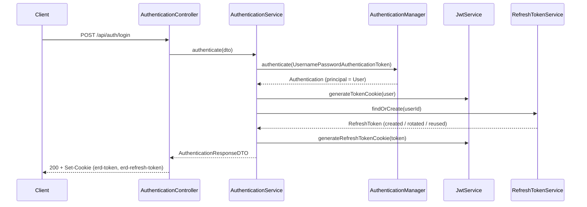
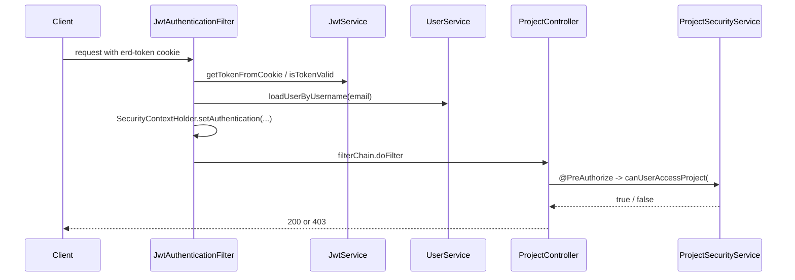
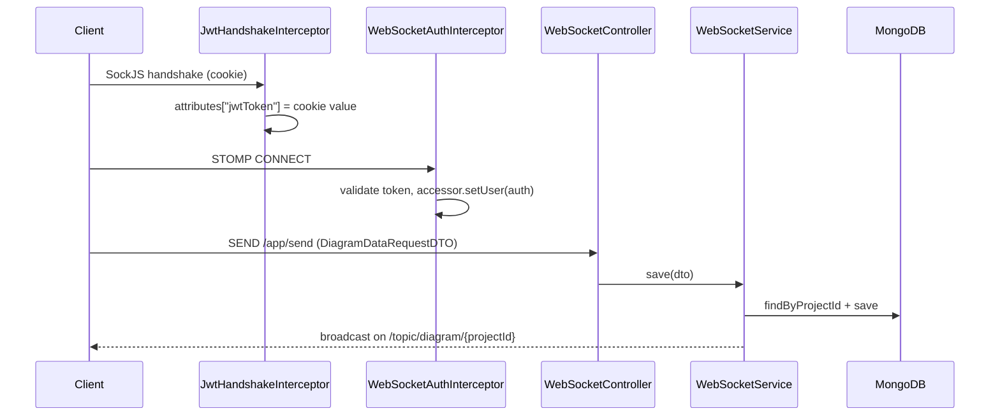

# ERD Core — Architecture and Testability Analysis

> Companion document to the test-coverage effort. It records what the system does, how its layers are
> built, and which testing technique each layer requires. Written as source material for the Testing
> chapter of the monograph.

---

## 1. Purpose and domain

`erd-core` is the backend of a **collaborative Entity-Relationship Diagram editor**. Several users open the
same project and edit its diagram simultaneously; the backend keeps the canonical diagram, broadcasts every
change to the other participants, and prevents two people from editing the same table at the same time.

Four capabilities define the system:

| Capability | Description |
| --- | --- |
| **Project and team management** | Users create projects and invite others with a per-project role (`OWNER`, `EDITOR`, `VIEWER`). |
| **Real-time diagram editing** | Diagram mutations travel over STOMP/WebSocket, are persisted, and are re-broadcast to every other client subscribed to the project topic. |
| **Entity locking** | While a user edits a table, that table is locked for everyone else. Locks expire automatically and are released when the user disconnects. |
| **DDL import/export** | A project's diagram can be generated from a SQL `CREATE TABLE` script, or exported back to one. |

## 2. Technology stack

| Concern | Choice |
| --- | --- |
| Runtime | Java 21, Spring Boot 3.4.2 |
| Relational persistence | Spring Data JPA + PostgreSQL — `User`, `Project`, `Team`, `RefreshToken` |
| Document persistence | Spring Data MongoDB — `Diagram`, storing nodes and links as JSON strings |
| Real time | `spring-boot-starter-websocket`, STOMP over SockJS |
| Security | Spring Security, cookie-based JWT (JJWT 0.12.6), `@EnableMethodSecurity` |
| Mapping | ModelMapper 3.2.1, plus one hand-written Spring component and one static utility class |
| Build | Maven (wrapper pinned to 3.9.5) |

Deliberate absences that shape how the code must be tested:

- **No Lombok and no Java records.** Every DTO and entity is a hand-written class with explicit accessors,
  so roughly 700 lines of the codebase are getters, setters and constructors that still count as coverable code.
- **No Bean Validation.** There is no `@Valid`, `@NotNull` or `@Email` anywhere, so there are no validation
  branches to test — but equally no framework-level guard against malformed input.
- **No global exception handler for generic errors.** Only `TokenControllerAdvice`, which handles
  `RefreshTokenException`. Every other controller wraps its body in `try/catch` and returns
  `badRequest()` / `notFound()` / `internalServerError()` inline. Those handlers are numerous, shallow, and
  are the single largest source of *branches* in the controller layer.
- **No AOP, no caching, no async.** The only cross-cutting behaviour is `@Transactional` on two
  `RefreshTokenService` methods and one `@Scheduled` method in `CollaborationService`.

## 3. Layer inventory

67 instrumented classes (70 source files, minus the 5 Spring Data repository interfaces which have no method
bodies, plus 2 anonymous `TypeReference` classes generated inside `DiagramMapper`).

### `com.erd.core` — bootstrap

| Class | Responsibility |
| --- | --- |
| `CoreApplication` | `@SpringBootApplication` + `@EnableScheduling` entry point. |

### `com.erd.core.config` — infrastructure wiring

| Class | Responsibility |
| --- | --- |
| `ApplicationConfig` | `PasswordEncoder` (BCrypt), `DaoAuthenticationProvider`, `AuthenticationManager`. |
| `SecurityConfig` | Stateless filter chain, CSRF off, per-route authority rules, CORS source. |
| `MvcConfig` | CORS mapping for `/api/**`. |
| `MapperConfig` | The `ModelMapper` bean. |
| `WebSocketConfig` | STOMP endpoint `/ws` (SockJS), simple broker on `/topic`, app prefix `/app`, heartbeat scheduler. |
| `JwtHandshakeInterceptor` | Copies the JWT cookie into the WebSocket session attributes during the HTTP handshake. |
| `WebSocketAuthInterceptor` | On STOMP `CONNECT`, turns that session attribute into an `Authentication`. |
| `WebSocketEventListener` | On `SessionDisconnectEvent`, releases the disconnecting user's entity locks. |

### `com.erd.core.controller` — HTTP and STOMP entry points

| Class | Endpoints |
| --- | --- |
| `AuthenticationController` | `POST /api/auth/login`, `/logout`, `/refresh-token`. |
| `UserController` | `POST /api/user` (signup). |
| `ProjectController` | 9 routes, CRUD + team management, all `@PreAuthorize`-guarded. |
| `DiagramController` | `POST /api/diagram`, `GET /api/diagram/{projectId}`. |
| `DdlController` | `POST /api/ddl/import`, `GET /api/ddl/export/{projectId}`. |
| `CollaborationController` | 6 lock-management routes; also publishes STOMP notifications. |
| `WebSocketController` | `@MessageMapping("/send")` — diagram mutations. |

### `com.erd.core.service` — business logic

| Class | Responsibility |
| --- | --- |
| `DdlService` | Largest class (366 LOC). Regex-based DDL parser and SQL generator, with bidirectional type mapping. |
| `ProjectService` | Project CRUD, team orchestration, cascading diagram deletion. |
| `TeamService` | Membership management and the "exactly one OWNER" invariant. |
| `ProjectSecurityService` | The SpEL bean referenced by every `@PreAuthorize` expression in the application. |
| `UserService` | `UserDetailsService` implementation plus signup. |
| `AuthenticationService` | Login, refresh, logout; builds the auth cookies. |
| `JwtService` | Token creation/validation and cookie build/read/delete. |
| `RefreshTokenService` | Refresh-token lookup, creation, rotation and expiry. |
| `CollaborationService` | In-memory `ConcurrentHashMap` lock registry + `@Scheduled` stale-lock reaper. |
| `DiagramService` | Mongo diagram CRUD. |
| `WebSocketService` | Persists a diagram from a STOMP message and broadcasts the result. |

### Other packages

- **`model`** — `User` (also implements `UserDetails`), `Project`, `Team`, `RefreshToken`, `mongo/Diagram`.
- **`repository`** — 5 Spring Data interfaces; 6 JPQL `@Query` methods, 4 of them DTO constructor projections.
- **`dto`** — 25 classes across `dto`, `dto.request`, `dto.response`, `dto.collaboration`, `dto.error`.
- **`mapper`** — `DiagramMapper` (Spring component, Jackson JSON ↔ DTO), `ProjectMapper` (static utility).
- **`enumeration`** — `RoleEnum` (`ADMIN`, `USER`), `RoleProjectEnum` (`OWNER`, `EDITOR`, `VIEWER`).
- **`exception`** — `RefreshTokenException`. **`advice`** — `TokenControllerAdvice`.
- **`filter`** — `JwtAuthenticationFilter`, `AuthenticationEntryPointJwt`.

## 4. Main flows

### 4.1 Authentication and token refresh



`findOrCreate` has three distinct outcomes — no token found, a found-but-expired token that gets rotated, and
a valid token that is reused — which is why it needs three separate tests.

### 4.2 Request authorization



The filter swallows every exception by design: an invalid token yields an anonymous request rather than a 500.

### 4.3 Real-time diagram editing



### 4.4 Entity locking

`CollaborationController` delegates to `CollaborationService`, which keeps locks in a `ConcurrentHashMap`
keyed by entity id. A lock is refused if another user holds it, released only by its owner, reaped after five
minutes by a `@Scheduled(fixedRate = 120000)` sweep, and dropped wholesale when
`WebSocketEventListener` observes the user's `SessionDisconnectEvent`.

### 4.5 DDL import/export

`DdlService` parses `CREATE TABLE` statements with regular expressions into `NodeDataDTO`/`LinkDataDTO`
structures, and generates `CREATE TABLE` + `ALTER TABLE ... ADD FOREIGN KEY` statements in the other
direction. Two `switch` expressions map SQL types to canonical diagram types and back.

## 5. Testability analysis

This is the reasoning behind the technique chosen for each layer.

| Layer | What makes it easy or hard | Technique |
| --- | --- | --- |
| **DTOs and entities** (30 classes, ~700 LOC) | No logic, but a very large share of the coverable lines. Writing 30 near-identical test classes would add bulk without adding meaning. | One reflective `@ParameterizedTest` (`PojoContractTest`) that invokes every declared constructor, round-trips every getter/setter pair, and checks getter-only classes against their all-args constructor. |
| **`User`** | Has real behaviour inside `getAuthorities()` — it defaults to `USER` when the role is null. | Explicit unit test covering both branches, separate from the reflective harness. |
| **Enumerations** | Trivial, but JaCoCo's filters must be trusted rather than assumed. | Explicit tests calling `values()` and `valueOf(...)`. |
| **Services** | Pure Spring beans with constructor injection and no static state, except where `@Value` fields and `SecurityContextHolder` are involved. | Mockito unit tests. `@Value` fields are populated with `ReflectionTestUtils.setField`; static `SecurityContextHolder` access is driven with `mockStatic`. |
| **`JwtService`** | Signing requires a real key, and `isTokenValid` has four separate catch blocks for four JJWT exception types. | Real (non-mocked) JJWT operations against a valid Base64 test secret, with one crafted token per exception type. |
| **Controllers** | Every endpoint is a `try` / `catch (RuntimeException)` / `catch (Exception)` triple, so the branch count is high but each branch is shallow. Authorization lives in `@PreAuthorize` annotations, which standalone MockMvc ignores. | Hybrid: `MockMvcBuilders.standaloneSetup` unit tests to drive all three outcomes of every endpoint, plus `@WebMvcTest` slices with `spring-security-test` to prove the `@PreAuthorize` rules actually reject unauthorized callers. |
| **Filters and WebSocket interceptors** | Servlet and messaging APIs, but all mockable; Spring's `MockHttpServletRequest`/`Response` and `StompHeaderAccessor` make the inputs constructible. | Mockito unit tests with Spring's mock servlet objects; `SecurityContextHolder` cleared in `@AfterEach`. |
| **Configuration classes** | Bean methods full of lambdas that only execute while Spring builds the beans. | The existing `@SpringBootTest` context load executes them for free (it already accounted for 65.8% of the `config` package at baseline). Directly-callable methods get focused unit tests as well. |
| **`CoreApplication.main`** | Would otherwise be permanently uncovered. | `mockStatic(SpringApplication.class)` and verify the `run` call. |
| **Repositories** | Spring Data interfaces with no method bodies contribute **zero** instrumented lines, so they cannot lower or raise the coverage figure. | Not required for coverage. A `@DataJpaTest` against H2 is worthwhile for correctness of the 6 JPQL queries, and is treated as an optional extra rather than part of the coverage target. |

### Why no coverage exclusions

It is common practice to add `sonar.coverage.exclusions` for DTOs, entities and configuration classes. That
was deliberately **not** done here. Excluding those packages would remove roughly a third of the codebase from
the denominator, and a "100% coverage" claim would then describe a filtered subset rather than the system.
`sonar-project.properties` contains no exclusions, and the JaCoCo rule is applied at `BUNDLE` level over
everything under `src/main/java`.

## 6. Coverage results

Measured with JaCoCo 0.8.12 via `mvnw verify`; the same `jacoco.xml` is what SonarQube consumes.

### Baseline — before this work

3 test classes, 24 test methods.

| Counter | Covered | Total | % |
| --- | --- | --- | --- |
| Instruction | 1,779 | 5,425 | **32.79%** |
| Branch | 82 | 246 | **33.33%** |
| Line | 461 | 1,428 | **32.28%** |
| Method | 144 | 475 | **30.32%** |
| Class | 44 | 67 | **65.67%** |

Per-package line coverage at baseline:

| Package | Line coverage |
| --- | --- |
| `enumeration` | 100% |
| `dto` | 67.5% |
| `config` | 65.8% |
| `advice` | 50% |
| `service` | 37.2% |
| `controller` | 21.6% |
| `filter` | 19.4% |
| `dto.response` | 19.2% |
| `mapper` | 16.7% |
| `dto.request` | 8.6% |
| `model` | 4.4% |
| `dto.collaboration`, `dto.error`, `exception`, `model.mongo` | 0% |

### Final — after this work

36 test classes, **323 test methods**.

| Counter | Covered | Total | % |
| --- | --- | --- | --- |
| Instruction | 5,414 | 5,414 | **100%** |
| Branch | 242 | 242 | **100%** |
| Line | 1,427 | 1,427 | **100%** |
| Complexity | 609 | 609 | **100%** |
| Method | 475 | 475 | **100%** |
| Class | 67 | 67 | **100%** |

Per-package breakdown:

| Package | Classes | Lines | Branches |
| --- | --- | --- | --- |
| `com.erd.core` | 1 | 3/3 | — |
| `com.erd.core.advice` | 1 | 2/2 | — |
| `com.erd.core.config` | 8 | 120/120 | 20/20 |
| `com.erd.core.controller` | 7 | 148/148 | 6/6 |
| `com.erd.core.dto` | 6 | 83/83 | — |
| `com.erd.core.dto.collaboration` | 1 | 27/27 | — |
| `com.erd.core.dto.error` | 1 | 11/11 | — |
| `com.erd.core.dto.request` | 10 | 81/81 | — |
| `com.erd.core.dto.response` | 7 | 130/130 | — |
| `com.erd.core.enumeration` | 2 | 4/4 | — |
| `com.erd.core.exception` | 1 | 2/2 | — |
| `com.erd.core.filter` | 2 | 36/36 | 6/6 |
| `com.erd.core.mapper` | 4 | 24/24 | — |
| `com.erd.core.model` | 4 | 90/90 | 2/2 |
| `com.erd.core.model.mongo` | 1 | 19/19 | — |
| `com.erd.core.repository` | 4 | — | — |
| `com.erd.core.repository.mongo` | 1 | — | — |
| `com.erd.core.service` | 11 | 647/647 | 208/208 |

The two repository packages contain no instrumented code: Spring Data interfaces have no method
bodies, so they contribute neither covered nor uncovered lines.

The build enforces this. `pom.xml` declares a JaCoCo `check` rule at `BUNDLE` level requiring
`LINE`, `BRANCH`, `METHOD` and `CLASS` `COVEREDRATIO >= 1.00`, bound to `verify`; any regression
fails the build locally and in CI.

### Progression

| Counter | Before | After |
| --- | --- | --- |
| Test classes | 3 | 36 |
| Test methods | 24 | 323 |
| Line coverage | 32.28% | **100%** |
| Branch coverage | 33.33% | **100%** |
| Method coverage | 30.32% | **100%** |
| Class coverage | 65.67% | **100%** |

### Test suite composition

| Test class | Target | Technique |
| --- | --- | --- |
| `PojoContractTest` | 30 DTOs and entities | Reflective `@ParameterizedTest` (60 cases) |
| `UserTest`, `DiagramTest`, `RoleEnumerationTest`, `RefreshTokenExceptionTest` | Model behaviour | Plain JUnit |
| `DdlServiceTest` *(pre-existing, unchanged)* | DDL import/export | Mockito |
| `DdlServiceCoverageTest` | DDL type maps and defensive branches | Mockito + real `ObjectMapper` |
| `JwtServiceTest` | Token lifecycle | Real JJWT operations |
| `ProjectSecurityServiceTest` | Authorization decisions | Mockito + `mockStatic` |
| `AuthenticationServiceTest`, `RefreshTokenServiceTest`, `UserServiceTest`, `ProjectServiceTest`, `TeamServiceTest`, `DiagramServiceTest`, `CollaborationServiceTest`, `WebSocketServiceTest` | Business logic | Mockito |
| `DiagramMapperTest`, `ProjectMapperTest` | Mapping | Real Jackson |
| `DdlControllerTest` *(pre-existing, unchanged)*, `AuthenticationControllerTest`, `UserControllerTest`, `DiagramControllerTest`, `ProjectControllerTest`, `CollaborationControllerTest`, `WebSocketControllerTest`, `TokenControllerAdviceTest` | HTTP and STOMP endpoints | Standalone MockMvc |
| `MethodSecurityRulesTest` | `@PreAuthorize` enforcement | `@SpringBootTest` + `spring-security-test` |
| `JwtAuthenticationFilterTest`, `AuthenticationEntryPointJwtTest`, `JwtHandshakeInterceptorTest`, `WebSocketAuthInterceptorTest`, `WebSocketEventListenerTest`, `ConfigurationBeansTest` | Security and WebSocket infrastructure | Mockito + Spring mock objects |
| `CoreApplicationTests` *(pre-existing, unchanged)*, `CoreApplicationMainTest` | Bootstrap | Context load + `mockStatic` |

### Techniques worth citing in the monograph

Four situations needed something beyond a plain mock:

1. **Reflective contract testing** — one parameterized test replaces 30 near-identical POJO test
   classes while still genuinely executing every constructor and accessor, including the read-only
   DTOs whose fields Jackson populates directly in production.
2. **Undeclared checked exceptions via `doAnswer`** — the `catch (Exception)` arm of every
   `CollaborationController` endpoint sits after a `catch (RuntimeException)`, so it is only
   reachable through a checked exception. Mockito's `thenThrow` refuses to throw one the method does
   not declare; an `Answer` lambda, whose `answer` method declares `throws Throwable`, does it.
3. **`mockStatic`** — used twice: to reach the failure branch guarding `SecurityContextHolder`
   access in `ProjectSecurityService`, and to execute `CoreApplication.main` without starting a
   second application context.
4. **Crafting one token per exception type** — `JwtService.isTokenValid` has four catch blocks;
   each is triggered by a purpose-built token (malformed string, negative lifetime, `alg: none`,
   empty string) rather than by stubbing the parser.

### Two unreachable branches removed

Reaching 100% branch coverage exposed two conditions in `DdlService` that could never evaluate both
ways. Both were removed after being proven invariant, and the 35 `DdlService` tests confirm the
behaviour is unchanged:

| Location | Condition | Why it was invariant |
| --- | --- | --- |
| `parseColumnDefinition` | `matcher.group(3) != null ? ... : ""` | Group 3 is `(.*)$`, which always matches — possibly as an empty string — so it is never `null`. |
| `parseDdlToLinkData` | `if (!tableMap.containsKey(sourceTable)) continue;` | `tableMap` is built by `parseDdlToNodeData` from the same regular expression over the same content, so every table matched here is always present. |

The sibling guard `if (!tableMap.containsKey(referencedTable)) continue;` **is** reachable — a
foreign key may reference a table declared outside the imported script — and is covered by
`testImportDdl_ignoresForeignKeysPointingOutsideTheScript`.

## 7. Observations found during exploration

These were identified while mapping the codebase. They are **recorded, not fixed**, so that the coverage work
stays purely additive and independently reviewable.

| # | Observation | Location |
| --- | --- | --- |
| 1 | `WebSocketService.sendToTopic` builds the destination from `savedDto.getProjectId()`, but `DiagramMapper.toResponseDto` never populates `projectId` — the broadcast goes to `/topic/diagram/null`. | `service/WebSocketService.java`, `mapper/DiagramMapper.java` |
| 2 | `ExportDdlRequestDTO` is referenced by no controller or service. | `dto/request/ExportDdlRequestDTO.java` |
| 3 | `DiagramMapper.convertToSting` is a public method with a typo in its name. | `mapper/DiagramMapper.java` |
| 3b | Two invariant conditions in `DdlService` were **removed** (see "Two unreachable branches removed" above) — the only production change made by this work. | `service/DdlService.java` |
| 4 | `ProjectSecurityService` imports `org.apache.logging.log4j.util.Strings` without using it. | `service/ProjectSecurityService.java` |
| 5 | `Diagram` imports Hibernate's `@UuidGenerator` although it is a Mongo document and never uses the annotation. | `model/mongo/Diagram.java` |
| 6 | `src/test/resources/application-test.yml` is dead configuration — no test activates the `test` profile, so the file is never loaded. Its MongoDB settings were copied into `src/test/resources/application.yml`, which *is* loaded; the original file was left in place and can now be deleted. | `src/test/resources/` |
| 7 | The test JWT secret was the literal string `test`, which is not a valid Base64-encoded 256-bit key; any test signing a token would have failed with `WeakKeyException`. Fixed as a prerequisite of this work. | `src/test/resources/application.yml` |
| 8 | Business errors are raised as bare `new RuntimeException("...")` throughout the service layer, so callers cannot distinguish "not found" from "forbidden" other than by message text. | `service/ProjectService.java`, `service/TeamService.java`, others |
| 9 | `ProjectMapper` is a static utility class with an implicit public constructor. | `mapper/ProjectMapper.java` |
| 10 | `UserRepository` is the only repository without `@Repository`. | `repository/UserRepository.java` |

## 8. Reproducing the report

There is no `java` or `mvn` on `PATH` on the development machine; the Maven Wrapper and an explicit JDK are used.

```powershell
$env:JAVA_HOME = "C:\Users\wayne\.jdks\temurin-21.0.11"

# compile, run the whole suite, produce the coverage report and enforce the 100% gate
.\mvnw.cmd -B verify

# human-readable report
start target\site\jacoco\index.html
```

Artifacts produced:

| Path | Purpose |
| --- | --- |
| `target/site/jacoco/index.html` | Browsable report — the source of the screenshots used in the monograph. |
| `target/site/jacoco/jacoco.xml` | Machine-readable report consumed by SonarQube. |
| `target/surefire-reports/` | Per-test JUnit results, also read by SonarQube. |

To publish to a SonarQube server once one is available:

```powershell
.\mvnw.cmd -B verify sonar:sonar -Dsonar.host.url=<url> -Dsonar.token=<token>
```
